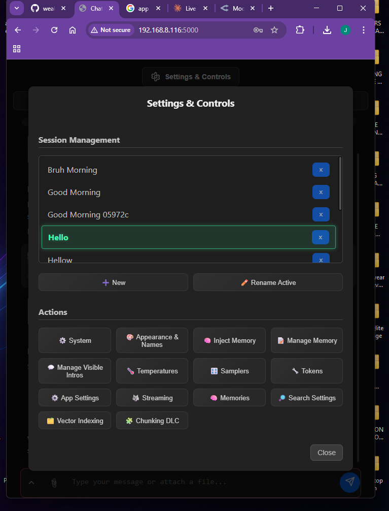

# 🦊 Vela — Local AI Chat Interface (note this my personal app i use daily don't take it too seriously if there are bugs report it to me.)

> A feature-rich local AI frontend for **KoboldAI** and **OpenRouter**, built with Flask + vanilla JS. Comes with semantic long-term memory, web search, persona/user loadouts, streaming responses, and a whole lot more. Sharing this cause i need feedbacks on what to improve as i am lazy on finding the bugs myself.

---

## 📸 Screenshots

<div align="center">

<table>
  <tr>
    <td></td>
    <td></td>
  </tr>
  <tr>
    <td></td>
    <td></td>
  </tr>
  <tr>
    <td colspan="2" align="center"></td>
  </tr>
</table>

</div>

---

## ✨ Features

### 🧠 Memory System
- **Short-term memory** — keeps recent conversation context in the prompt window
- **Long-term memory** — stores past conversations and retrieves relevant ones semantically using **FAISS** vector search
- **Ghost memory** — older messages are soft-archived and recalled only when relevant
- **Sanity Check (Stage 3)** — intent detection gate that filters memory recall using phrase embeddings, preventing irrelevant memory from bleeding into responses

### 🔍 Semantic Search & Retrieval
- **FAISS vector index** with support for both L2 and Cosine similarity metrics
- **Two-stage retrieval** — FAISS candidate fetch → optional **Cross-Encoder reranker** for precision scoring
- **Asymmetric embedding** — query and document prefixes applied automatically per model (Nomic, Jina, etc.)
- **Zeroshot DLC** — NLI-based intent classification using models like DeBERTa, MiniLM, BART for smarter recall gating

### 🌐 Web Search
- Integrated **DuckDuckGo search** (`ddgs`) triggered by `<tool_search>` tokens in the AI response
- Web page scraping via BeautifulSoup for full-content retrieval
- Configurable search settings and result injection into context

### 🤖 Embedding Models (Swappable)
| Model | Dimensions | Context |
|---|---|---|
| `nomic-embed-text-v1.5` | 768d | 8K |
| `jina-embeddings-v2-base` | 768d | 8K |
| `jina-embeddings-v2-small` | 512d | 8K |
| `all-mpnet-base-v2` | 768d | 512 |
| `all-MiniLM-L6-v2` | 384d | 256 |

### 🎭 Personas & User Loadouts
- Create and switch between multiple **AI personas** with custom system prompts, avatars, and names
- **User loadouts** — save different "you" profiles (name, avatar, personality context)
- Persona and user images stored separately and persisted across sessions

### ⚙️ Reranker Models (Optional)
- `ms-marco-MiniLM-L-6-v2` (fast)
- `ms-marco-MiniLM-L-12-v2`
- `bge-reranker-base` / `bge-reranker-v2-m3`
- `jina-reranker-v2-base-multilingual`
- `Qwen2.5-Reranker-0.6B` / `4B`
- `FlashRank` (external library)

### 🖥️ Frontend
- Clean dark-themed UI with toast notifications and ripple effects
- **Streaming responses** with abort support
- **Markdown rendering** via Marked.js (GFM + tables + line breaks)
- File attachment support
- Collapsible chat panels and settings modal
- XSS-safe toast system (textContent only, never innerHTML)

### 🔧 Backend (Flask)
- Thread-safe memory I/O with `RLock` (reentrant lock for nested read/write)
- Thread-safe FAISS index writes with a separate `Lock`
- Cache-Control headers on `/get_*` endpoints to prevent browser caching stale settings
- Auto-indexes FAISS on startup for the current session
- Debug mode gated via `USE_DEBUG=1` env var (never exposes Werkzeug debugger on LAN by default)
- Accessible on LAN at `0.0.0.0:5000`

---

## 🚀 Getting Started

### Requirements
- Python 3.10+
- Windows (launcher is a `.bat` file)
- KoboldAI running locally **or** an OpenRouter API key

### Installation

1. Clone the repo:
```bash
git clone https://github.com/yourusername/rivet.git
cd rivet
```

2. Run the launcher — it handles everything automatically:
```
LAUNCHER.bat
```

The launcher will:
- ✅ Check for Python
- ✅ Check for pip
- ✅ Install all missing packages automatically
- ✅ Run a Flake8 lint check on `app.py`
- ✅ Start the Flask server at `http://127.0.0.1:5000`

### Manual Install (optional)
```bash
pip install flask flask-cors fuzzywuzzy rapidfuzz requests python-dateutil ddgs tiktoken sentence-transformers faiss-cpu numpy beautifulsoup4
```

---

## ⚙️ Configuration

All settings are managed through the **Settings & Controls** panel in the UI. Configurations are saved as JSON files locally:

| File | Purpose |
|---|---|
| `sanity_check_settings.json` | Memory recall intent detection settings |
| `user_loadouts.json` | Saved user profiles |
| `current_user_loadout.txt` | Active user profile |
| `persona_images/` | Stored persona avatars |
| `user_loadout_images/` | Stored user avatars |
| `saved_images/` | Chat image attachments |

---

## 🧩 Backend Modes

| Mode | Description |
|---|---|
| **KoboldAI** | Connects to a local KoboldAI instance at `http://127.0.0.1:5001/v1/chat/completions` |
| **OpenRouter** | Connects to `https://openrouter.ai/api/v1/chat/completions` with your API key and chosen model |

---

## 📦 Tech Stack

- **Backend:** Python, Flask, Flask-CORS
- **Vector Search:** FAISS, Sentence Transformers, CrossEncoder
- **Search:** DuckDuckGo Search (`ddgs`), BeautifulSoup4
- **NLI / Zeroshot:** DeBERTa, MiniLM, BART (via HuggingFace)
- **Tokenization:** tiktoken
- **Frontend:** HTML, CSS, Vanilla JS, Marked.js

---

## 📝 License

This project is licensed under the **Apache 2.0 License** — see the [LICENSE](LICENSE) file for details.
