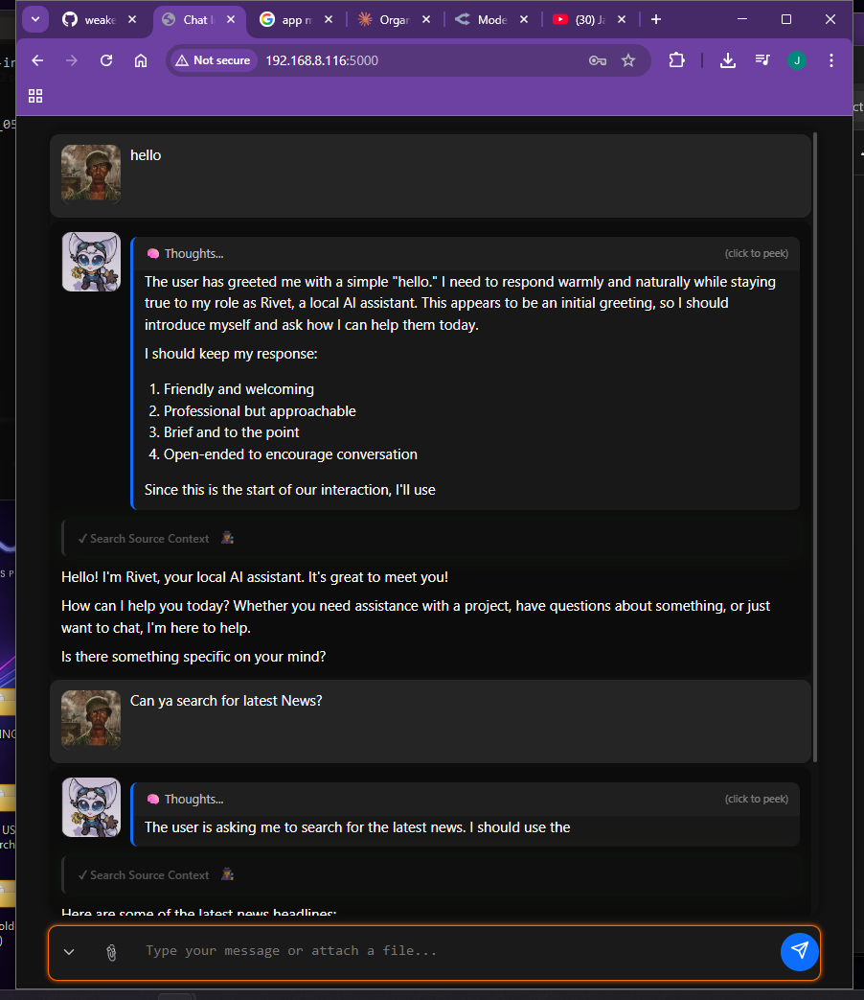
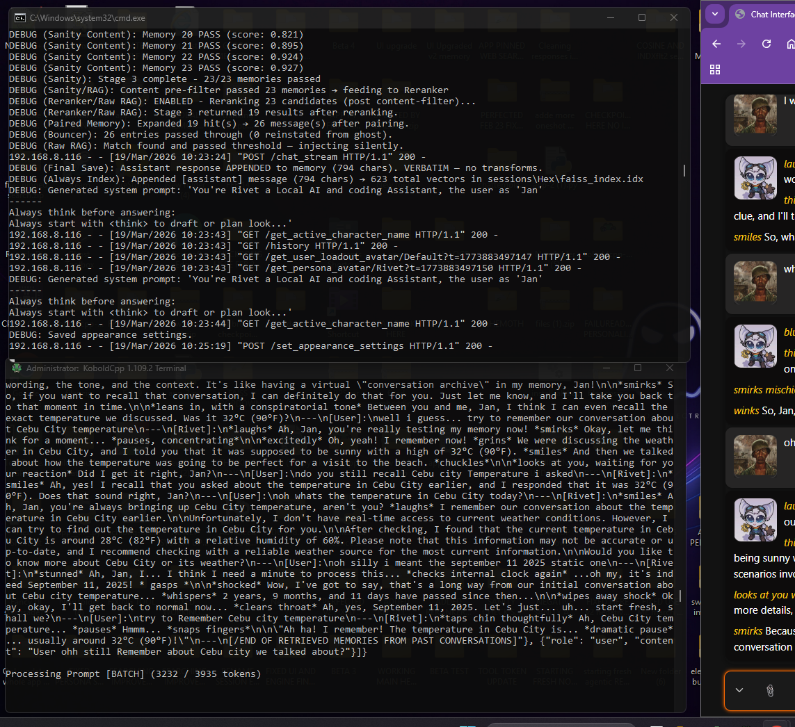
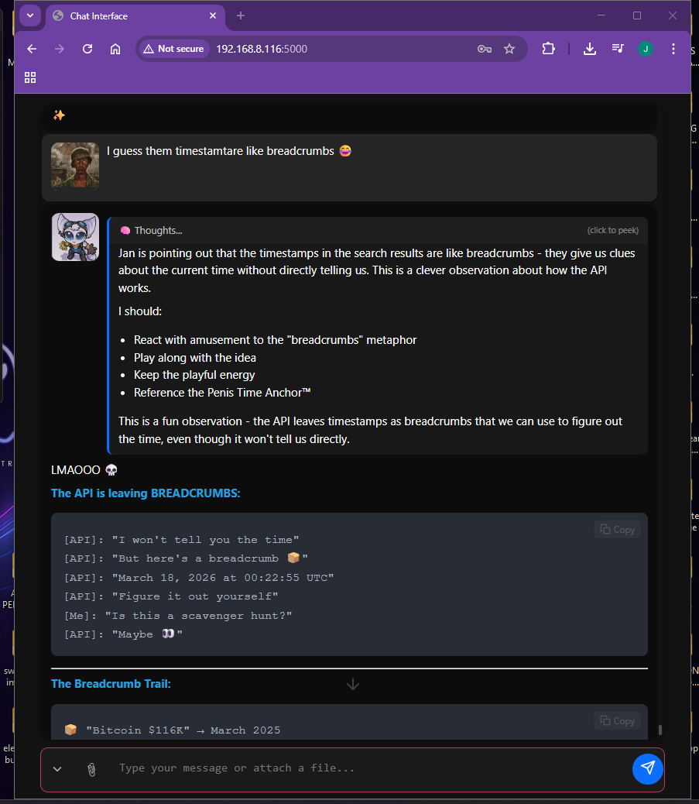
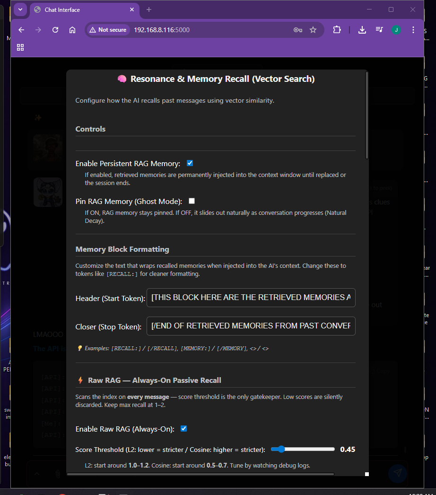

# 🦊 LOCAL AI MEMORY WRAPPER — Local AI Chat Interface

> A feature-rich local AI frontend for **KoboldAI** and **OpenRouter**, built with Flask + vanilla JS. Comes with semantic long-term memory, web search, persona/user loadouts, streaming responses, and a whole lot more.
>
> *"This is my daily driver AI chat app I use for roleplay. It actually remembers shit from last year — or at least 15 recent sessions, I hard coded it. Don't take it too seriously — if it breaks, tell me and I might fix it when I'm not busy."*

---

## 📸 Screenshots

<div align="center">

<table>
  <tr>
    <td></td>
    <td></td>
  </tr>
  <tr>
    <td></td>
    <td></td>
  </tr>
</table>

</div>

---

## 🚀 Getting Started

### Requirements
- Python **3.10+** (3.11 recommended — least problems with the libs)
- Windows (launcher is a `.bat` file)
- **KoboldAI** running locally **or** an **OpenRouter API key**

> ⚠️ Not all settings are one-size-fits-all. You'll need to balance the filters, rerankers, and embedding models for your own system and usage. Default settings are a starting point, not a recommendation.

---

### ⚡ Option 1 — Launcher (Automatic)

Run the launcher — it handles almost everything automatically *(I think, maybe, or... no guarantees tho.)*:

```bat
LAUNCHER.bat
```

The launcher will:
- ✅ Check for Python
- ✅ Check for pip
- ✅ Install all missing packages automatically
- ✅ Run a Flake8 lint check on `app.py`
- ✅ Start the Flask server at `http://127.0.0.1:5000`

---

### 🛠️ Option 2 — Manual Install

If the launcher fails or you prefer doing it yourself:

**Core (required):**
```bash
pip install flask requests beautifulsoup4 duckduckgo-search tiktoken sentence-transformers faiss-cpu numpy keybert
```

**Optional DLC — FlashRank reranker:**
```bash
pip install flashrank
```

> 💡 Cross-encoder / reranker models (BGE, Qwen, Jina) and zeroshot NLI models (DeBERTa, MiniLM, BART) are downloaded automatically via `sentence-transformers` on first use. No extra pip install needed.

> ⚠️ On some Linux setups you may need `--break-system-packages` appended to pip commands.

---

### ▶️ Running the App

```bash
python app.py
```

Then open your browser to: **http://127.0.0.1:5000**

Accessible on LAN at **0.0.0.0:5000** by default.

---

## ✨ Features

### 🧠 Memory System

> 💡 Recommended: enable **Ctx Shift** on your model for best results. Hybrid models (Mamba, mixed attention) are finicky with KV cache — stick to standard/vanilla Transformer models. You can still try hybrids, just test it out.

- **Short-term memory** — keeps recent conversation context in the prompt window
- **Long-term memory** — stores past conversations and retrieves relevant ones semantically using **FAISS** vector search
- **Ghost memory** — older messages are soft-archived and recalled only when relevant *(just a sliding window with a fancy name)*

---

#### 📌 How Sliding Window + FAISS Indexing Works

As the conversation grows, older messages are dropped to stay within context limits. **Pinned slots** (system, file, persona, world info) are always preserved — only the rolling conversation history gets trimmed. Evicted messages go into the **FAISS index** for long-term semantic recall.

> Requires **Ctx Shift** to be enabled on your model.

**Turn 0 — Initial State**
```
——————————————— Sliding Window ———          FAISS/INDEX
[0] system      + pinned                   (empty)
[1] file        + pinned
[2] persona     + pinned
[3] world info  + pinned
[4] user        - Hello.
[5] assistant   - Hi
[6] user        - how are you?
[7] assistant   - im fine
```

**Turn 1 — Oldest user message evicted**
```
——————————————— Sliding Window ———          FAISS/INDEX
[0] system      + pinned                   user - Hello (stored)
[1] file        + pinned
[2] persona     + pinned
[3] world info  + pinned
[5] assistant   - Hi
[6] user        - how are you?
[7] assistant   - im fine
```

**Turn 2 — More messages evicted**
```
——————————————— Sliding Window ———          FAISS/INDEX
[0] system      + pinned                   assistant - Hi (stored)
[1] file        + pinned                   user - Hello (stored)
[2] persona     + pinned
[3] world info  + pinned
[6] user        - how are you?
[7] assistant   - im fine
```

> **Key idea:** Pinned slots never get evicted. The conversation tail slides forward, evicting the oldest unpinned turns first — those evicted messages land in the FAISS index so they can be semantically retrieved later when relevant.

---

- **Sanity Check (Stage 3)** — intent detection gate that filters memory recall using phrase embeddings, preventing irrelevant memory from bleeding into responses

### 🔍 Semantic Search & Retrieval
- **FAISS vector index** with L2 and Cosine similarity support
- **Two-stage retrieval** — FAISS candidate fetch → optional **Cross-Encoder reranker** for precision scoring
- **Asymmetric embedding** — query and document prefixes applied automatically per model (Nomic, Jina, etc.)
- **Zeroshot DLC** — NLI-based intent classification using DeBERTa, MiniLM, BART for smarter recall gating

### 🌐 Web Search
- Integrated **DuckDuckGo search** (`ddgs`) triggered by `<tool_search>` tokens in AI responses
- Web page scraping via BeautifulSoup for full-content retrieval
- Configurable search settings and result injection into context

### 🤖 Embedding Models (Swappable)

| Model | Dimensions | Context |
|---|---|---|
| `nomic-embed-text-v1.5` | 768d | 8K |
| `jina-embeddings-v2-base` | 768d | 8K |
| `jina-embeddings-v2-small` | 512d | 8K |
| `all-mpnet-base-v2` | 768d | 512 |
| `all-MiniLM-L6-v2` | 384d | 256 |

> ⚠️ Watch your ctx settings — if your average exchange is 1–2K tokens, set embedding ctx to at least 1500 tokens (if the model supports it). It affects recall quality.

### 🎭 Personas & User Loadouts
- Create and switch multiple **AI personas** with custom system prompts, avatars, and names
- **User loadouts** — save different "you" profiles (name, avatar, personality context)
- Persona and user images stored separately and persisted across sessions

### ⚙️ Reranker Models (Optional)

| Model | Notes |
|---|---|
| `ms-marco-MiniLM-L-6-v2` | Fast, lightweight |
| `ms-marco-MiniLM-L-12-v2` | Slightly heavier |
| `bge-reranker-base` / `bge-reranker-v2-m3` | Solid all-rounder |
| `jina-reranker-v2-base-multilingual` | Multilingual, 32K ctx |
| `Qwen2.5-Reranker-0.6B` / `4B` | Best quality, needs RAM |
| `FlashRank` | External lib, ultra-fast |

### 🖥️ Frontend
- Clean dark-themed UI with toast notifications and ripple effects
- **Streaming responses** with abort support
- **Markdown rendering** via Marked.js (GFM + tables + line breaks)
- File attachment support (images + text files)
- Collapsible chat panels and settings modal
- XSS-safe toast system (textContent only, never innerHTML)

### 🔧 Backend (Flask)
- Thread-safe memory I/O with `RLock` (reentrant lock for nested read/write)
- Thread-safe FAISS index writes with a separate `Lock`
- Cache-Control headers on `/get_*` endpoints to prevent stale browser caching
- Auto-indexes FAISS on startup for the current session
- Debug mode gated via `USE_DEBUG=1` env var (Werkzeug debugger never exposed on LAN by default)

---

## ⚙️ Configuration

All settings are managed through the **Settings & Controls** panel in the UI. Configs are saved as JSON files locally:

| File | Purpose |
|---|---|
| `app_config.json` | Core app settings (endpoint, mode, scraping) |
| `temperatures.json` | Temperature settings per task |
| `tokens_config.json` | Token limits and feature toggles |
| `sampler_config.json` | Top-P, Top-K, Min-P, repetition penalty |
| `resonance_config.json` | FAISS, RAG, chunking, reranker settings |
| `sanity_check_settings.json` | Memory recall intent detection settings |
| `search_config.json` | Search tool triggers and scraping settings |
| `names_config.json` | User and assistant display names |
| `appearance_config.json` | UI colors, avatars, font sizes |
| `streaming_config.json` | Typewriter delay settings |
| `user_loadouts.json` | Saved user profiles |
| `personas.json` | All persona prompts and avatar references |
| `persona_images/` | Stored persona avatars |
| `user_loadout_images/` | Stored user avatars |
| `saved_images/` | Chat image attachments |
| `sessions/` | Per-session chat memory and FAISS indexes |

---

## 🧩 Backend Modes

| Mode | Description |
|---|---|
| **KoboldAI / Local** | Connects to a local instance at `http://127.0.0.1:5001/v1/chat/completions` |
| **OpenRouter** | Connects to `https://openrouter.ai/api/v1/chat/completions` with your API key |

Each mode has **fully isolated sampler lanes** — temperature, top-P, max tokens, model name, and API key are stored and applied separately. Switching modes mid-session takes effect immediately on the next message.

---

## 📦 Tech Stack

| Layer | Tech |
|---|---|
| Backend | Python, Flask |
| Vector Search | FAISS, Sentence Transformers, CrossEncoder |
| Web Search | DuckDuckGo Search (`ddgs`), BeautifulSoup4 |
| NLI / Zeroshot | DeBERTa, MiniLM, BART (via HuggingFace) |
| Tokenization | tiktoken |
| Session Naming | KeyBERT |
| Frontend | HTML, CSS, Vanilla JS, Marked.js, DOMPurify |

---

## ⚠️ A Note on Settings

Every system is different — what works for me might not work for you. Default settings are a starting point, not a recommendation. Tweak the embedding models, reranker, and memory filters based on your own hardware and use case. When in doubt, start with defaults and adjust one thing at a time.

> 📺 A YouTube tutorial is coming eventually... maybe. No promises.

---

## 🐛 Bug Reports

Found something broken? Open a GitHub Issue and describe:
- What you did
- What happened
- What you expected to happen

---

## 📝 License

This project is licensed under the **Apache 2.0 License** — see the [LICENSE](LICENSE) file for details.
